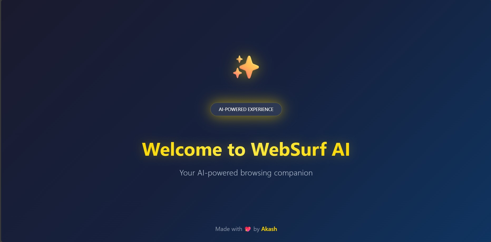
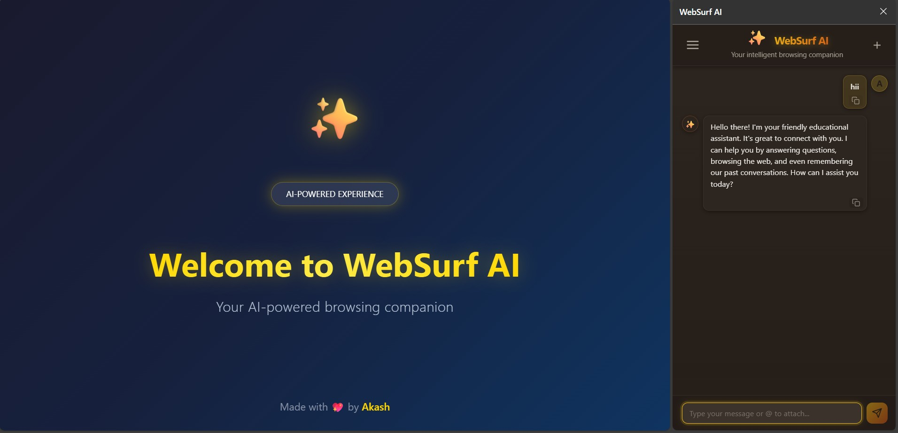

# WebSurf-AI — Your Intelligent Browsing Companion

**WebSurf-AI** is a powerful, open-source AI agent that revolutionizes your web browsing experience. It integrates seamlessly into your browser as a sidebar extension, providing you with a persistent, context-aware assistant that can perform complex tasks, automate workflows, and enhance your productivity while ensuring your privacy.

##


## Key Highlights

-   **✨ AI-Powered Web Browsing:** Delegate tasks to an intelligent agent that can understand and interact with web pages. It can view, scroll, click, fill out forms, and even take screenshots.
-   **Privacy First:** Operates with a separate, sandboxed browser profile to protect your personal data and maintain your privacy. All operations can be run locally.
-   **Persistent Context:** Maintains a consistent and persistent context of your browsing session, allowing for more intelligent and relevant assistance over time.
-   **Easy Control via Sidebar Extension:** A user-friendly sidebar interface allows you to easily control the agent, issue commands, and view its progress without leaving your current tab.
-   **Advanced Data Handling:** Supports embedding and analysis of PDF and text files, allowing the agent to work with a wider range of data sources.
-   **Secure and Local:** Built with security in mind, using OAuth2 for authentication. The entire stack can be run locally, giving you full control over your data.
-   **Modern Tech Stack:** Powered by FastAPI, Pydantic-AI, and a robust Chrome extension, ensuring a high-performance and reliable experience.
-   **Portable Distribution:** Comes with a standalone launcher that automatically handles Node.js runtime and dependencies, making deployment effortless.

## Preview



## Overview

WebSurf-AI is a full-stack application designed to bring the power of AI to your web browser. The backend is a FastAPI server that orchestrates the AI agent's actions, while the frontend is a Chrome extension that provides a seamless user interface.

The agent is capable of performing a wide range of tasks, from simple web navigation to complex data extraction and form submission. It uses a combination of computer vision and accessibility APIs to understand and interact with web pages, just like a human would.

## Tech Stack

-   **Backend:** FastAPI (Python)
-   **AI Orchestration:** Pydantic-AI
-   **Browser Automation:** Playwright
-   **Database:** SQLAlchemy (PostgreSQL recommended)
-   **Authentication:** JWT (OAuth2 password flow)
-   **Frontend:** Chrome Extension (JavaScript, HTML, CSS)
-   **MCP Server:** Model Context Protocol server for browser automation

## Features

-   **Web Navigation:** Open, close, and navigate between tabs.
-   **Page Interaction:** Click buttons, links, and other elements.
-   **Scrolling:** Scroll up, down, left, or right.
-   **Form Filling:** Fill out text boxes, checkboxes, and other form fields.
-   **Screenshots:** Capture full-page or partial screenshots.
-   **Data Extraction:** Extract text and other data from web pages.
-   **File Embeddings:** Attach and process PDF and text files.
-   **RAG and Conversational AI:** Switch between Retrieval-Augmented Generation for factual queries and a conversational mode for more general chat.

## Quick Run (Development)

### Prerequisites

-   Python 3.12+
-   Node.js & npm (optional - portable version auto-downloads if not present)
-   PostgreSQL (or adapt the database URL in your environment)

### 1. Backend

-   Create and activate a Python virtual environment.
-   Install dependencies from `pyproject.toml`:
    ```bash
    pip install -e .
    ```
-   Copy the `example.env` file to `.env` and set your database and JWT secrets.
-   Run the FastAPI server:
    ```bash
    uvicorn app.app:app --reload --host 0.0.0.0 --port 8000
    ```

### 2. MCP Browser Server (Recommended)

The easiest way to run WebSurf-AI is using the automated launcher:

#### Windows

1. Navigate to the `websurf-build` directory
2. Run the launcher script:
   ```powershell
   .\launch.ps1
   ```
3. The script will:
   - Check for Node.js installation (uses system Node if available)
   - Download portable Node.js if not found (~30MB, one-time)
   - Install dependencies automatically
   - Download Chromium browser (~150MB, one-time)
   - Launch the browser with the extension pre-loaded
   - Create a desktop shortcut for future launches

#### Using the Shortcut

After the first run, you can launch WebSurf-AI by:
- Double-clicking the `WebSurf MCP.lnk` shortcut in the `websurf-build` directory
- The shortcut automatically applies the WebSurf icon if `websurf.ico` is present

#### Manual Method

Alternatively, you can run the MCP server manually:
```bash
cd websurf-mcp
node browser-mcp.js
```

This will launch the AI-powered browser with the extension loaded.

### 3. Frontend (Chrome Extension)

If you prefer to load the extension manually:

-   Navigate to `chrome://extensions` in your Chrome browser.
-   Enable "Developer mode".
-   Click "Load unpacked" and select the `chrome-extension` directory.
-   The WebSurf-AI icon will appear in your toolbar. Click it to open the sidebar and start using the agent.

**Note:** Sign up before logging in. All data stays on your local machine with OAuth2 protection for privacy.

## Distribution

### Creating a Portable Package

The launcher system creates a fully portable distribution that includes:
- Portable Node.js runtime (if system Node is not available)
- All dependencies auto-installed on first run
- Chromium browser downloaded automatically
- Desktop shortcut with custom icon
- No installation required for end users

To distribute WebSurf-AI:
1. Share the entire `websurf-build` and `websurf-mcp` directories
2. Users simply run `launch.ps1` (Windows) or use the created shortcut
3. Everything downloads and sets up automatically on first launch

## Project Structure

```
websurf-ai/
├── app/                      # FastAPI backend
│   ├── app.py               # Application bootstrap
│   ├── routes/              # API endpoints
│   └── services/            # Business logic
├── chrome-extension/         # Browser extension
│   ├── manifest.json        # Extension configuration
│   └── sidepanel.js         # Sidebar interface
├── websurf-mcp/             # MCP server implementation
│   ├── browser-mcp.js       # Main MCP server
│   └── browser-server.js    # Browser automation server
└── websurf-build/           # Portable launcher
    ├── launch.ps1           # Windows launcher script
    ├── main-launcher.js     # Node.js launcher logic
    └── websurf.ico          # Application icon
```

## Key Files

-   `app/app.py`: FastAPI application bootstrap and middleware.
-   `app/routes/agent_routes.py`: API endpoints for controlling the AI agent.
-   `app/routes/auth_routes.py`: User signup, login, and profile management.
-   `app/services/agent_service.py`: Core logic for the AI agent's tasks.
-   `chrome-extension/manifest.json`: Configuration for the Chrome extension.
-   `chrome-extension/sidepanel.js`: Frontend logic for the sidebar interface.
-   `websurf-mcp/browser-mcp.js`: Model Context Protocol server for browser automation.
-   `websurf-build/launch.ps1`: Automated launcher with dependency management.

## Important API Endpoints

-   `POST /signup`: Register a new user.
-   `POST /token`: Obtain a JWT for authentication.
-   `GET /users/me/`: Get the current user's profile.
-   `PUT /update_profile`: Update the current user's profile.
-   `POST /agent/run`: Execute a task with the AI agent.
-   `GET /agent/collections`: Get available RAG embedding collections.

## Troubleshooting

### Launcher Issues

If the launcher fails to start:
1. Ensure you have internet connectivity for first-time setup
2. Check that no antivirus is blocking the downloads
3. Verify disk space (~200MB required for browser and Node.js)
4. Try running PowerShell as Administrator if permission errors occur

### Manual Cleanup

To reset the installation:
```powershell
# Remove portable Node.js
Remove-Item -Recurse -Force .node-portable

# Remove browser installation
Remove-Item -Recurse -Force chromium

# Remove dependency markers
Remove-Item websurf-mcp/.deps-installed
Remove-Item .browser-installed
```

---

Made with 💖 by Akash